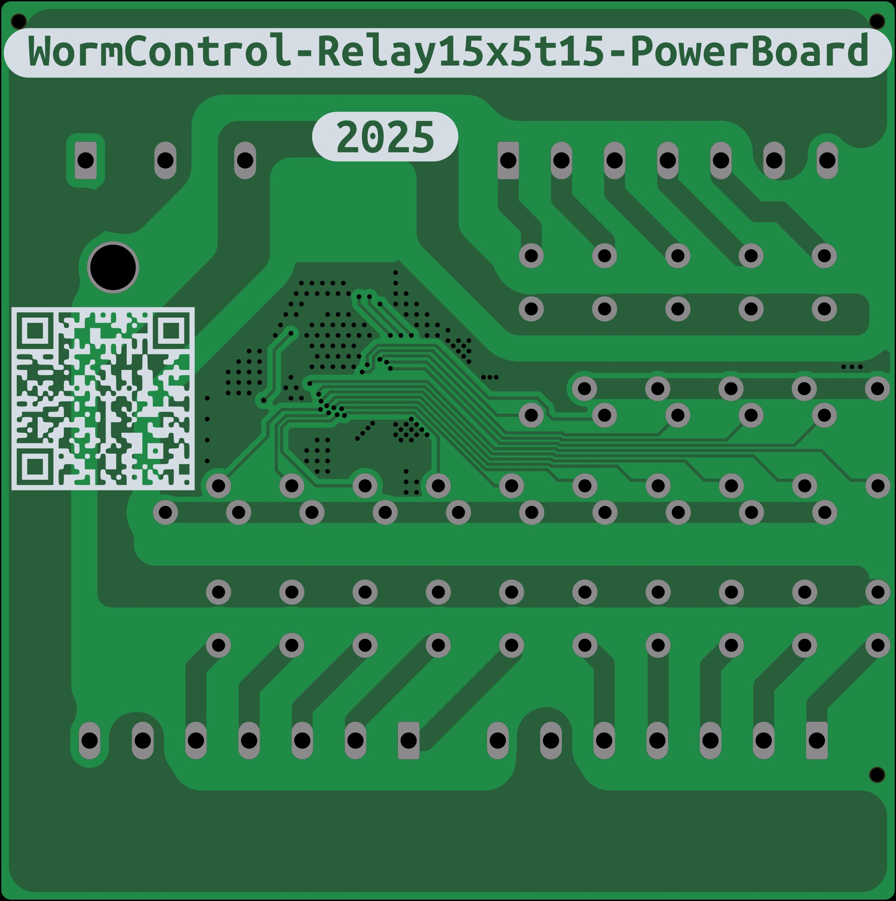
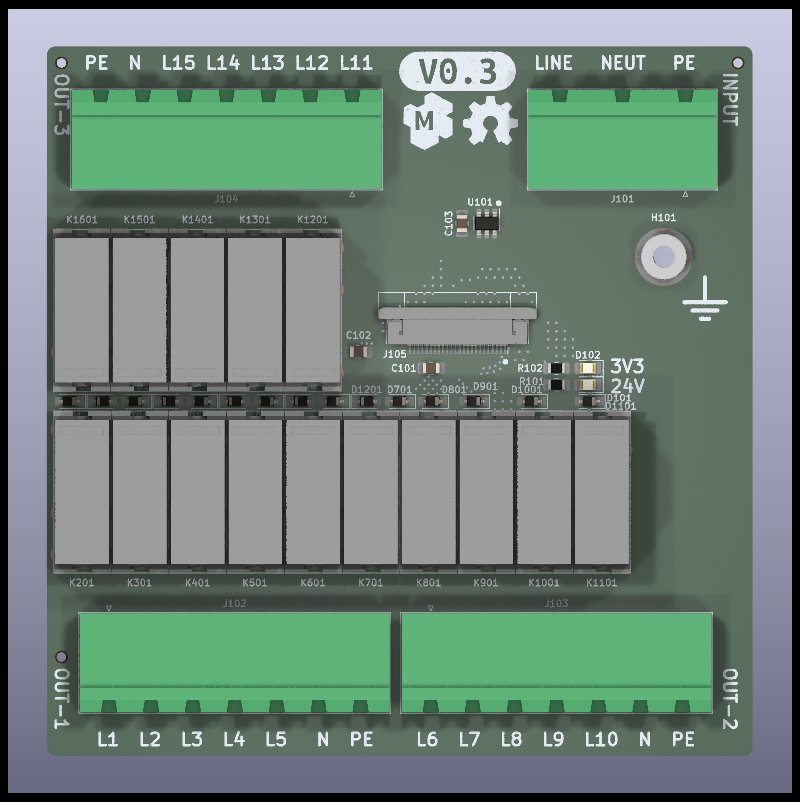

---

WormControl Relay PowerBoard

NOTE: This is only a prototype now, so things might not work and everything might change 

Basic target features:

* Compatibility with esphome and Home Assistant

Dev NOTE: before commit, run `./kibot.sh` to regenerate documentation, bom, gerbers and other assets.

* [schematics.pdf](gen/schematics.pdf)
* [pcb.pdf with dimensions](gen/pcb.pdf)
* [ibom.html](gen/single/ibom.html)

---

